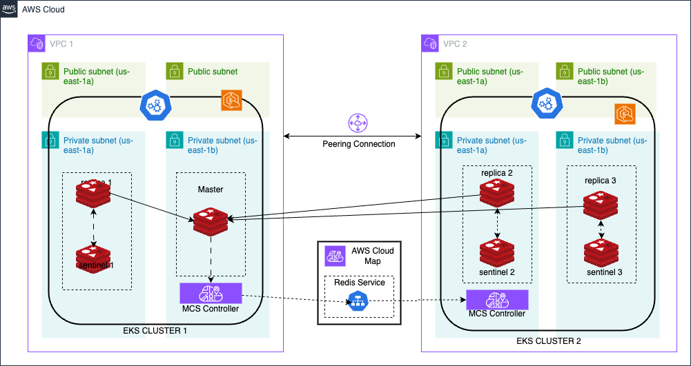

# multi-cluster-redis-ha

## Overview
This repository helps to deploys the redis in a high availability setup across two different EKS cluster distributed across 2 different VPC in the same region. 

## System Architecture Diagram
#### Architecture Diagram

#### Network Diagram

## Dependecies & Assumptions

#### Assumptions
1) You are deploying Redis in a high-availability configuration across two Amazon EKS clusters that are located in different VPCs but within the same AWS region.
2) The Redis deployment is intended for production use, and you have considered aspects such as redundancy, failover, and data replication.
3) You have a basic understanding of AWS, Terraform, and Kubernetes.
4) Your infrastructure follows AWS best practices for security, networking, and resource management.

#### Dependecies
1) **Terraform**: The configuration is written using Terraform. You need to have Terraform installed to deploy the infrastructure. The version used in the example is 1.9.3.
2) **AWS CLI**: The AWS Command Line Interface (CLI) is required to authenticate and interact with AWS services. Ensure it is installed and configured. The version used in the example is 2.17.23.
3) **kubectl**: You will use Kubernetes command-line tool to interact with your EKS clusters. Ensure it is installed and configured for both clusters. The version used in the example is 1.30.3.
4) **Helm (optional)**: We will be using Helm charts for Redis deployment, ensure Helm is installed. The version used in the example is 3.15.3.
5) **eksctl**: You will use eksctl command-line to configure eks cluster. Ensure eksctl is installed and configured if you plan to use it. The version used in the example is 0.188.0.

#### Pre-Reqs

1) **Terraform Setup:**
    1) Ensure Terraform is installed on your local machine or CI/CD environment.
    2) Initialize Terraform with terraform init and ensure that you have access to the Terraform state storage (e.g., an S3 bucket for remote state management).
    3) Review and update the Terraform configuration files as needed to match your environment (e.g., VPC IDs, cluster names, etc.).
    4) Define and configure any necessary variables and environment-specific settings in the Terraform files.
2) **AWS Account Configuration:**
    1) Ensure you have an AWS account with appropriate IAM permissions to create and manage EKS clusters, VPCs, and other AWS resources.
    2) Configure AWS credentials using the AWS CLI (aws configure) or through environment variables.

## Infrastructure & Permissions
#### Resources
| # | Name | Resource |
| :---: | :---: | :---:|
| 1 | redis1-demo-cluster | first eks cluster |
| 2 | redis2-demo-cluster | Second eks cluster |
| 3 | redis1-node-group | node group for 1st cluster |
| 4 | redis2-node-group | node group for 2nd cluster |
| 5 | vpc-cni-plugin | EKS Add on |
| 6 | ebs-csi-driver | EKS add on |
| 7 | dev-vpc1-igw  | internet-gateway for 1st cluster |
| 8 | dev-vpc2-igw  | internet-gateway for 2nd  cluster |
| 9 | dev-vpc1-nat  | nat-gateway for 1st   cluster |
| 10 | dev-vpc2-nat  | nat-gateway for 2nd   cluster |
| 11 | redis-ha.internal | private route 53 hosted zone for redis-ha setup |
|12 | redis MCS controller | Cloud Map MCS-Controller to enable closs cluster service discovery |
| 13 | redis-nodes | runs in replication mode. One master and multiple plicas with sentinel

#### Network
| # | Name | Type  | Network config | 
| :---: | :---: | :---:| :---:|
| 1 | eks-cluster | xyz|
|2 | eks-cluster-node| abc|
| 3 | vpc-cni-plugin | cvb |
| 4 | ebs-csi-driver | dsd |
| 5 | internet-gateway | dss|
| 6 | nat-gateway | dsds |
| 7 | rout 53 hosted zone| sdsds|

#### Permissions
| # | Name | Service Account  | Permission | 
| :---: | :---: | :---:| :---:|
| 1 | eks-cluster | xyz| sasas|
|2 | eks-cluster-node| abc|
| 3 | vpc-cni-plugin | cvb |
| 4 | ebs-csi-driver | dsd |
| 5 | internet-gateway | dss|
| 6 | nat-gateway | dsds |
| 7 | rout 53 hosted zone| sdsds|
## Deployment

## Security & Relability
