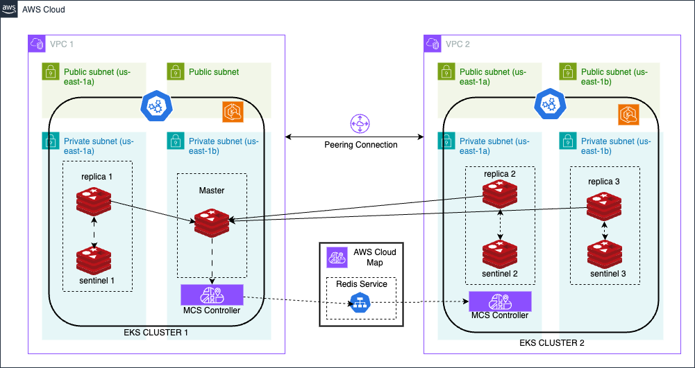

# multi-cluster-redis-ha

## Overview
This repository helps to deploys the redis in a high availability setup across two different EKS cluster distributed across 2 different VPC in the same region. 

## System Architecture Diagram
### Architecture Diagram


## Dependecies & Assumptions

### Assumptions
1) You are deploying Redis in a high-availability configuration across two Amazon EKS clusters that are located in different VPCs but within the same AWS region.
2) The Redis deployment is intended for production use, and you have considered aspects such as redundancy, failover, and data replication.
3) You have a basic understanding of AWS, Terraform, and Kubernetes.
4) Your infrastructure follows AWS best practices for security, networking, and resource management.

### Dependecies
1) **Terraform**: The configuration is written using Terraform. You need to have Terraform installed to deploy the infrastructure. The version used in the example is 1.9.3.
2) **AWS CLI**: The AWS Command Line Interface (CLI) is required to authenticate and interact with AWS services. Ensure it is installed and configured. The version used in the example is 2.17.23.
3) **kubectl**: You will use Kubernetes command-line tool to interact with your EKS clusters. Ensure it is installed and configured for both clusters. The version used in the example is 1.30.3.
4) **Helm (optional)**: We will be using Helm charts for Redis deployment, ensure Helm is installed. The version used in the example is 3.15.3.
5) **eksctl**: You will use eksctl command-line to configure eks cluster. Ensure eksctl is installed and configured if you plan to use it. The version used in the example is 0.188.0.

### Pre-Reqs

1) **Terraform Setup:**
    1) Ensure Terraform is installed on your local machine or CI/CD environment.
    2) Initialize Terraform with terraform init and ensure that you have access to the Terraform state storage (e.g., an S3 bucket for remote state management).
    3) Review and update the Terraform configuration files as needed to match your environment (e.g., VPC IDs, cluster names, etc.).
    4) Define and configure any necessary variables and environment-specific settings in the Terraform files.
2) **AWS Account Configuration:**
    1) Ensure you have an AWS account with appropriate IAM permissions to create and manage EKS clusters, VPCs, and other AWS resources.
    2) Configure AWS credentials using the AWS CLI (aws configure) or through environment variables.

## Infrastructure & Permissions
### Resources
| # | Name | Resource |
| :---: | :---: | :---:|
| 1 | redis1-demo-cluster | first eks cluster |
| 2 | redis2-demo-cluster | Second eks cluster |
| 3 | redis1-node-group | node group for 1st cluster |
| 4 | redis2-node-group | node group for 2nd cluster |
| 5 | vpc-cni-plugin | EKS Add on |
| 6 | ebs-csi-driver | EKS add on |
| 7 | dev-vpc1-igw  | internet-gateway for 1st cluster |
| 8 | dev-vpc2-igw  | internet-gateway for 2nd  cluster |
| 9 | dev-vpc1-nat  | nat-gateway for 1st   cluster |
| 10 | dev-vpc2-nat  | nat-gateway for 2nd   cluster |
| 11 | redis-ha.internal | private route 53 hosted zone for redis-ha setup |
|12 | redis MCS controller | Cloud Map MCS-Controller to enable closs cluster service discovery |
| 13 | redis-nodes | runs in replication mode. One master and multiple plicas with sentinel

### Network
| # | Name | Type  | Network config | 
| :---: | :---: | :---:| :---:|
| 1 | redis1-vpc-us-east-1 | redis 1 vpc| 10.5.0.0/16 |
| 2 | redis1-vpc-private-us-east-1a| redis 1 vpc private subnet 1 | 10.5.11.0/24 |
| 3 | redis1-vpc-private-us-east-1b | redis 1 vpc private subnet 2 | 10.5.12.0/24 |
| 4 | redis1-vpc-private-route-table | redis 1 private route table | - |
| 5 | redis1-vpc-public-us-east-1a | redis 1 vpc public subnet 1 | 10.5.1.0/24 |
| 6 | redis1-vpc-public-us-east-1b | redis 1 vpc public subnet 2 | 10.5.2.0/24 |
| 7 | redis1-vpc-public-route-table| redis 1 public route table| - |
| 8 | redis2-vpc-us-east-1 | redis 2 vpc| 10.6.0.0/16 |
| 9 | redis2-vpc-private-us-east-1a| redis 2 vpc private subnet 1 | 10.6.11.0/24 |
| 10 | redis2-vpc-private-us-east-1b | redis 2 vpc private subnet 2 | 10.6.12.0/24 |
| 11 | redis2-vpc-private-route-table | redis 2 private route table | - |
| 12 | redis2-vpc-public-us-east-1a | redis 2 vpc public subnet 1 | 10.6.1.0/24 |
| 13 | redis2-vpc-public-us-east-1b | redis 2 vpc public subnet 2 | 10.6.1.0/24 |
| 14 | redis2-vpc-public-route-table| redis 2 public route table| - |
| 15 | redis-cluster-peering-connection | redis 1 & redis 2 VPC peering connection | - |
| 16 | redis-ha.internal | internal hosted zone |

### Permissions
| # | Component | Permission | 
| :---: | :---: | :---:|
| 1 | eks-cluster | arn:aws:iam::aws:policy/AmazonEKSClusterPolicy | sasas|
| 2 | eks-cluster| arn:aws:iam::aws:policy/AmazonEKSVPCResourceController |
| 3 | eks-cluster-node-group | arn:aws:iam::aws:policy/AmazonEKSWorkerNodePolicy |
| 4 | eks-cluster-node-group | arn:aws:iam::aws:policy/AmazonEKS_CNI_Policy |
| 5 | eks-cluster-node-group | arn:aws:iam::aws:policy/AmazonEC2ContainerRegistryReadOnly|
| 6 | VPC CNI plugin | arn:aws:iam::aws:policy/AmazonEKS_CNI_Policy |
| 7 | EBS CSI Driver | arn:aws:iam::aws:policy/service-role/AmazonEBSCSIDriverPolicy |
| 8 | CloudMap MCS Controller | arn:aws:iam::aws:policy/AWSCloudMapFullAccess |

## Deployment

1) We will use terraform script to install the infra. The main.tf is the main terraform file used to deploy the infrastructure. Update the variables in the main.tf file.

2) Deploy the infra by running the following command:
    ```
    terraform init
    terraform plan
    terraform apply
    ```
    The above terraform script will create 2 VPC in us-east-1 region wit 2 public and 2 private subnets in each of these 2 VPCs. The script will then create VPC peering connection between these 2 VPCs and create the required route table entry. The script will also create a internal hosted zone that will be used by external DNS for internal hostname resolution. Finally the script will deploy an EKS cluster with 2 nodes (t3.medium) in both the VPC. It will also deploy EKS add-ons such as VPC CNI and EBS CSI driver into the EKS cluster.

3) Export the kubeconfig of both the cluster into your local system by running the following commands
    ```
    aws eks update-kubeconfig --region us-east-1 --name=redis1-demo-cluster
    aws eks update-kubeconfig --region us-east-1 --name=redis2-demo-cluster
    ```

4) The next step is to enable cross connection/ service discovery between the 2 kubernetes cluster. You can do this by installing Cloud Map MCS Controller in both the cluster. For details you can following [this](https://aws.amazon.com/blogs/opensource/kubernetes-multi-cluster-service-discovery-using-open-source-aws-cloud-map-mcs-controller/) document.

    Enable cross-connection in 1st cluster
    ```
    ## Run these commands from the repository root directory
    kubectl config use-context <first cluster context>

    cd  applications/cross-connection/

    kubectl apply -f coredns/

    eksctl utils associate-iam-oidc-provider --region us-east-1 --cluster redis1-demo-cluster --approve

    kubectl create namespace cloud-map-mcs-system

    eksctl create iamserviceaccount --cluster redis1-demo-cluster \
    --namespace cloud-map-mcs-system \
    --name cloud-map-mcs-controller-manager \
    --attach-policy-arn arn:aws:iam::aws:policy/AWSCloudMapFullAccess \
    --override-existing-serviceaccounts \
    --approve

    export AWS_REGION=us-east-1
    envsubst < MCS-controller/mcs_controller.yaml | kubectl apply -f -

    kubectl apply -f cluster-set/cluster1-property.yaml

    ```

    Enable cross-connection in 2nd cluster
    ```
    ## Run these commands from the repository root directory
    kubectl config use-context <Second cluster context>

    cd  applications/cross-connection/

    kubectl apply -f coredns/

    eksctl utils associate-iam-oidc-provider --region us-east-1 --cluster redis2-demo-cluster --approve

    kubectl create namespace cloud-map-mcs-system

    eksctl create iamserviceaccount --cluster redis2-demo-cluster \
    --namespace cloud-map-mcs-system \
    --name cloud-map-mcs-controller-manager \
    --attach-policy-arn arn:aws:iam::aws:policy/AWSCloudMapFullAccess \
    --override-existing-serviceaccounts \
    --approve

    export AWS_REGION=us-east-1
    envsubst < MCS-controller/mcs_controller.yaml | kubectl apply -f -

    kubectl apply -f cluster-set/cluster2-property.yaml

    ```

5) Install external DNS in cluster 1

    1) Switch to the first cluster using the comand `kubectl config use-context <first cluster context>`
    2) First create the AWS secrets (external_dns_secrets.yaml) file with the following content:
        ```
        apiVersion: v1
        kind: Secret
        metadata:
        name: external-dns-secret
        type: Opaque
        data:
        accessKeyID: ## Replace the accessKey ID
        secretAccessKey: ## Replace the secret access key
        ```

    3) Apply the secrets using the command `kubectl apply -f external_dns_secrets.yaml`
    4) Deploy the external DNS using the following command:
    ```
    ## Run these commands from the repository root directory

    cd  applications/external-dn/
    
    helm install external-dns oci://registry-1.docker.io/bitnamicharts/external-dns -f values.yaml
    ```
6) Install the redis in 1st cluster:
    1) Switch to the first cluster using the command `kubectl config use-context <first cluster context>`
    2) First create the redis secrets (redis_secrets.yaml) file with the following content:
        ```
        apiVersion: v1
        kind: Secret
        metadata:
        name: redis-secret
        type: Opaque
        data:
        redis_password: ## Replace with redis password
        ```

    3) Apply the secrets using the command `kubectl apply -f redis_secrets.yaml`
    4) Deploy the redis using the following command:
    ```
    ## Run these commands from the repository root directory

    cd  applications/redis-ha/
    
    helm install redis-cluster-1 oci://registry-1.docker.io/bitnamicharts/redis -f values-cluster1.yaml
    ```
    5) Export the redis service so it can be used in second cluster by running this command:
    ```
    kubectl apply -f export-service.yaml
    ```
    6) Check the exported service using the command `kubectl get serviceexport`

7) Install external DNS in cluster 2

    1) Switch to the second cluster using the command `kubectl config use-context <second cluster context>`
    2) First create the AWS secrets (external_dns_secrets.yaml) file with the following content:
        ```
        apiVersion: v1
        kind: Secret
        metadata:
        name: external-dns-secret
        type: Opaque
        data:
        accessKeyID: ## Replace the accessKey ID
        secretAccessKey: ## Replace the secret access key
        ```

    3) Apply the secrets using the command `kubectl apply -f external_dns_secrets.yaml`
    4) Deploy the external DNS using the following command:
    ```
    ## Run these commands from the repository root directory

    cd  applications/external-dn/
    
    helm install external-dns oci://registry-1.docker.io/bitnamicharts/external-dns -f values.yaml
    ```
6) Install the redis in 2nd cluster:
    1) Check the exported service using these commands:
    ```
    kubectl get serviceimports.multicluster.x-k8s.io

    kubectl get endpointslices.discovery.k8s.io
    ```
    2) Switch to the 2nd cluster using the command `kubectl config use-context <second cluster context>`
    3) First create the redis secrets (redis_secrets.yaml) file with the following content:
        ```
        apiVersion: v1
        kind: Secret
        metadata:
        name: redis-secret
        type: Opaque
        data:
        redis_password: ## Replace with redis password
        ```

    4) Apply the secrets using the command `kubectl apply -f redis_secrets.yaml`
    5) Deploy the redis using the following command:
    ```
    ## Run these commands from the repository root directory

    cd  applications/redis-ha/
    
    helm install redis-cluster-2 oci://registry-1.docker.io/bitnamicharts/redis -f values-cluster2.yaml
    ```
## Security & Relability

### Security
1) **Network Isolation**:

    1) **VPC Separation**: By deploying Redis across two separate VPCs, you achieve network isolation, reducing the risk of unauthorized access and limiting the potential impact of security breaches. Each VPC acts as a security boundary, enhancing overall network security.
2) **Controlled Access**:

    1) **Security Groups**: Utilizing security groups for each VPC allows precise control over network traffic to and from Redis instances. You can enforce strict access rules, ensuring that only authorized services and users can connect to Redis.
3) **Enhanced Encryption**:

    1) **In-Transit Encryption**: Encrypting data in transit between Redis nodes and clients ensures that sensitive data is protected from eavesdropping and tampering. This is especially important in a distributed setup across multiple VPCs.
    2) **At-Rest Encryption**: Implementing encryption at rest safeguards data stored on disk, protecting it from unauthorized access even if storage volumes are compromised.
4) **Improved Authentication and Authorization**:

    1) **IAM Roles and Policies**: Using IAM roles with strict policies for accessing AWS resources ensures that only authorized entities can manage and interact with your Redis infrastructure.
    2) **Kubernetes RBAC**: Implementing Role-Based Access Control (RBAC) within Kubernetes ensures that only authorized users and services have access to Redis resources, adhering to the principle of least privilege.

### Reliability
1) **High Availability**:

    1) **Multi-VPC Deployment**: Deploying Redis across two VPCs ensures that your Redis infrastructure remains resilient to failures in a single VPC. This setup enhances availability and ensures continuous operation even if one VPC encounters issues.
    2) **Replication and Failover**: Using Redis replication and failover mechanisms (such as Redis Sentinel or Redis Cluster) ensures that data is consistently available across both clusters. In the event of a failure, replicas can be promoted to primary, minimizing downtime.
2) **Disaster Recovery**:

    1) **Geographic Redundancy**: The distributed architecture across multiple VPCs provides geographic redundancy, enhancing your disaster recovery capabilities. This setup ensures that your Redis instances are protected from localized failures or outages.
    2) **Backup Strategy**: Regular backups and snapshots of Redis data ensure that you can recover from data loss scenarios. Automated backup solutions provide additional peace of mind and minimize recovery time.
3) **Scalability**:

    1) **Horizontal Scaling**: The architecture supports horizontal scaling by adding more Redis instances or nodes as needed. This flexibility allows you to handle increased load and ensure optimal performance.
    2) **Cluster Autoscaling**: EKS clusters can be configured to automatically scale based on demand, ensuring that your Redis deployment remains responsive and resource-efficient under varying loads.
4) **Redundancy**:

    1) **Load Balancing**: Distributing traffic across multiple Redis instances and clusters ensures that no single instance becomes a point of failure. Load balancers can automatically redirect traffic to healthy instances, maintaining service continuity.
    2) **Health Checks**: Implementing health checks ensures that failed Redis instances are promptly detected and replaced, maintaining the overall reliability of the system.
5) **Regular Maintenance**:

    1) **Automated Updates**: Regular updates to Redis, Kubernetes, and Terraform configurations ensure that you benefit from the latest features and security patches. This proactive approach helps maintain the reliability and security of your infrastructure.

## Cleanup
1) Remove the service account 
    ```
    eksctl delete iamserviceaccount --cluster redis1-demo-cluster \
    --namespace cloud-map-mcs-system \
    --name cloud-map-mcs-controller-manager --approve

    eksctl delete iamserviceaccount --cluster redis2-demo-cluster \
    --namespace cloud-map-mcs-system \
    --name cloud-map-mcs-controller-manager --approve
    ```
2) Remove the infrastructure using the following command
    ```
    ## Run these commands from the repository root directory
    cd infrastucture
    terraform destroy
    ```